  

  

  
  
  

  

---

## ⚔️ Soldier Record

  

Hey! I'm **Faheem**, a **Full Stack Developer** who would rather ride beyond the Walls than stay safe inside them. Most of my days are Laravel and React, but I also build security tooling in Go and train NLP models in Python.

- 🗡️ **Current expedition**: [PushWarden](https://github.com/FaheemRafiq/pushwarden), real-time protection against supply-chain malware on developer machines.
- 🧠 **Research squad**: Mentor AI, with an [emotion classifier](https://github.com/FaheemRafiq/emotion-classifier) that gives the LLM context about how the user feels.
- 🏋️ **Cadet training**: Cloud infrastructure with AWS, DevOps practices, and Go.
- 💬 **Ask me about**: PHP, Laravel, JavaScript, cloud deployments, or database optimization.
- 🕊️ **Send a messenger**: <faheemrafiqdev@gmail.com>
- ⚡ **Fun fact**: I can binge-watch an entire anime season in one night! 🍿

---

## 🪝 ODM Gear

  

  <h3>Twin Blades · Core Stack</h3>
  

    
  

  <h3>Grapple Hooks · Frontend</h3>
  

    
  

  <h3>Gas Canisters · Backend & Databases</h3>
  

    
  

  <h3>Supply Wagon · DevOps & Tools</h3>
  

    
  

### 🎖️ Commendations

- **AWS**: Deployed and managed scalable applications on EC2 with CI/CD pipelines.
- **Linux**: Comfortable with server administration, scripting, and deployment.
- **MySQL**: Optimized database schemas and queries for high-performance applications.
- **Security**: Built PushWarden to catch supply-chain malware before it reaches a developer's machine.

---

## 🗺️ Expeditions Beyond the Walls

  

<table>
  <tr>
    <td width="50%" valign="top">
      <h3>🛡️ <a href="https://github.com/FaheemRafiq/pushwarden">PushWarden</a></h3>
      
<code>57th Expedition · Wall defence</code>

      
Real-time protection against the PolinRider / Contagious Interview supply-chain malware for developer machines.

      

        
        
        
        
      

      
<a href="https://faheemrafiq.github.io/pushwarden/">📖 Website and docs</a>

    </td>
    <td width="50%" valign="top">
      <h3>🧠 <a href="https://github.com/FaheemRafiq/emotion-classifier">Emotion Classifier</a></h3>
      
<code>Research Squad · Field study</code>

      
A supervised NLP classifier for Mentor AI. It reads a journal entry or message and predicts one of seven emotions with a calibrated confidence.

      

        
        
        
      

    </td>
  </tr>
  <tr>
    <td width="50%" valign="top">
      <h3>🎓 <a href="https://github.com/FaheemRafiq/gcs_admission_system">GCS Admission System</a></h3>
      
<code>Cadet Corps · Enlistment office</code>

      
A web application for managing admission forms, examinations, and the admin work around them.

      

        
        
        
        
      

    </td>
    <td width="50%" valign="top">
      <h3>🔀 <a href="https://github.com/FaheemRafiq/nodejs-proxy-server">Reverse Proxy Server</a></h3>
      
<code>Garrison · Gate duty</code>

      
A lightweight, configurable reverse proxy that routes requests to several local services, exposes them through Ngrok, and logs every request and response.

      

        
        
        
      

    </td>
  </tr>
</table>

  <a href="https://github.com/FaheemRafiq?tab=repositories">Read the full expedition log →</a>

  

---

## 📜 Field Report

  
  

  

  

---

## 👁️ Titan Sighting

  

 

| What I say | What the Survey Corps hears |
| :-- | :-- |
| "It works on my machine" | Wall Maria has been breached. |
| "Just a small refactor" | We are riding beyond the Walls. Write your letters home. |
| "I'll fix it properly later" | The basement key will explain everything. Eventually. |
| "It's a one-line change" | A Colossal diff has appeared over the Wall. |
| "Deploying on Friday" | Advance! Nobody mention the casualty forecast. |
| "One more episode" | It is 4 AM and the Rumbling has started. |

  

 

  
   
  Me, pointing at the feature I'll build right after lunch.

---

## 🕯️ Words From Inside the Walls

> **"If you win, you live. If you lose, you die. If you don't fight, you can't win!"**
>  — Eren Yeager

> **"Dedicate your hearts!"**
>  — Erwin Smith

> **"The only thing we're allowed to do is believe that we won't regret the choice we made."**
>  — Levi Ackerman

> **"People who can't throw something important away can never hope to change anything."**
>  — Armin Arlert

---

## 📺 Watch Log

- 📺 **Currently Watching**: *Mashle: Magic and Muscles* 💪
- 💬 **Favorite Dev Quote**: "Code is like humor. When you have to explain it, it's bad." – Cory House

---

## 🕊️ Join the Regiment

  
  
  

  

Shinzou wo sasageyo.

