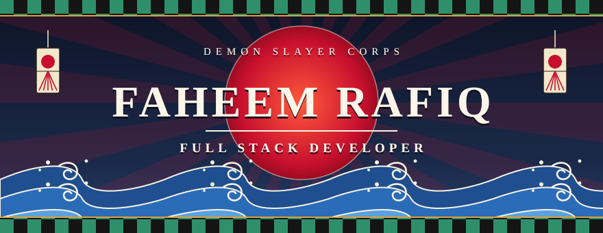

  

  

  
  
  

  

---

## 🎴 Slayer Record

  

Hey! I'm **Faheem**, a **Full Stack Developer** who survived Final Selection and has been swinging the blade ever since. Most of my days are Laravel and React, but I also build security tooling in Go and train NLP models in Python.

- ⚔️ **Current mission**: [PushWarden](https://github.com/FaheemRafiq/pushwarden), real-time protection against supply-chain malware on developer machines.
- 🧠 **Side mission**: Mentor AI, with an [emotion classifier](https://github.com/FaheemRafiq/emotion-classifier) that gives the LLM context about how the user feels.
- 🌊 **Training under the waterfall**: Cloud infrastructure with AWS, DevOps practices, and Go.
- 💬 **Ask me about**: PHP, Laravel, JavaScript, cloud deployments, or database optimization.
- 🐦 **Send a crow**: <faheemrafiqdev@gmail.com>
- ⚡ **Secret technique**: I can binge-watch an entire anime season in one night! 🍿

---

## 🌊 Breathing Forms

  <h3>First Form · Core Stack</h3>
  

    
  

  <h3>Second Form · Frontend</h3>
  

    
  

  <h3>Third Form · Backend & Databases</h3>
  

    
  

  <h3>Fourth Form · DevOps & Tools</h3>
  

    
  

### 👹 Demons Slain

- **AWS**: Deployed and managed scalable applications on EC2 with CI/CD pipelines.
- **Linux**: Comfortable with server administration, scripting, and deployment.
- **MySQL**: Optimized database schemas and queries for high-performance applications.
- **Security**: Built PushWarden to catch supply-chain malware before it reaches a developer's machine.

---

## 🔥 Mission Scroll

  

<table>
  <tr>
    <td width="50%" valign="top">
      <h3>🛡️ <a href="https://github.com/FaheemRafiq/pushwarden">PushWarden</a></h3>
      
<code>Threat: Upper Rank demon</code>

      
Real-time protection against the PolinRider / Contagious Interview supply-chain malware for developer machines.

      

        
        
        
        
      

      
<a href="https://faheemrafiq.github.io/pushwarden/">📖 Website and docs</a>

    </td>
    <td width="50%" valign="top">
      <h3>🧠 <a href="https://github.com/FaheemRafiq/emotion-classifier">Emotion Classifier</a></h3>
      
<code>Threat: Lower Rank demon</code>

      
A supervised NLP classifier for Mentor AI. It reads a journal entry or message and predicts one of seven emotions with a calibrated confidence.

      

        
        
        
      

    </td>
  </tr>
  <tr>
    <td width="50%" valign="top">
      <h3>🎓 <a href="https://github.com/FaheemRafiq/gcs_admission_system">GCS Admission System</a></h3>
      
<code>Threat: Mansion demon</code>

      
A web application for managing admission forms, examinations, and the admin work around them.

      

        
        
        
        
      

    </td>
    <td width="50%" valign="top">
      <h3>🔀 <a href="https://github.com/FaheemRafiq/nodejs-proxy-server">Reverse Proxy Server</a></h3>
      
<code>Threat: Swamp demon</code>

      
A lightweight, configurable reverse proxy that routes requests to several local services, exposes them through Ngrok, and logs every request and response.

      

        
        
        
      

    </td>
  </tr>
</table>

  <a href="https://github.com/FaheemRafiq?tab=repositories">Read the rest of the mission scroll →</a>

  

---

## 📜 Corps Ledger

  
  

  

  

---

## 🐦 Kasugai Crow Dispatch

  

 

| What I say | What the crow reports |
| :-- | :-- |
| "It works on my machine" | `CAW! The demon only appears in production! CAW!` |
| "Just a small refactor" | `CAW! He has entered the Infinity Castle! CAW!` |
| "I'll fix it properly later" | `CAW! The demon has regenerated! CAW!` |
| "It's a one-line change" | `CAW! Fourteen files! FOURTEEN! CAW!` |
| "Deploying on Friday" | `CAW! Night is falling! Run! CAW!` |
| "One more episode" | `CAW! The sun is rising! Go to sleep! CAW!` |

  

 

  
   
  Me, reading code I wrote six months ago.

---

## 🗡️ Words of the Corps

> **"Go ahead and live with your head held high. No matter how devastated you may be by your own weakness or uselessness, set your heart ablaze. Grit your teeth and look straight ahead."**
>  — Kyojuro Rengoku

> **"If you can only do one thing, hone it to perfection. Hone it to the utmost limit!"**
>  — Jigoro Kuwajima

> **"No matter how many people you may lose, you have no choice but to go on living — no matter how devastating the blows may be."**
>  — Tanjiro Kamado

> **"Feel the rage. The powerful, pure rage of not being able to forgive will become your unswerving drive to take action."**
>  — Giyu Tomioka

> **"Those who regretted their own actions, I would never trample over them. Because demons were once human too."**
>  — Tanjiro Kamado

  

---

## 📺 Watch Log

- 📺 **Currently Watching**: *Mashle: Magic and Muscles* 💪
- 💬 **Favorite Dev Quote**: "Code is like humor. When you have to explain it, it's bad." – Cory House

---

## ✉️ Send a Crow

  
  
  

  

Total Concentration. Constant.

