  

  

  
  
  

---

## 🪪 Student ID

  

Hey! I'm **Faheem**, a **Full Stack Developer**. I was born without a single drop of magic, so I solve everything the other way: reps. Most of my days are Laravel and React, but I also build security tooling in Go and train NLP models in Python.

- 💪 **Current workout**: [PushWarden](https://github.com/FaheemRafiq/pushwarden), real-time protection against supply-chain malware on developer machines.
- 🧠 **Extra credit**: Mentor AI, with an [emotion classifier](https://github.com/FaheemRafiq/emotion-classifier) that gives the LLM context about how the user feels.
- 🏋️ **Adding weight**: Cloud infrastructure with AWS, DevOps practices, and Go.
- 💬 **Ask me about**: PHP, Laravel, JavaScript, cloud deployments, or database optimization.
- 🦉 **Send an owl**: <faheemrafiqdev@gmail.com>
- 🍿 **Fun fact**: I can binge-watch an entire anime season in one night!

---

## 🪄 Spells (He Just Uses Muscles)

  <h3>Core Stack · "Regular Push-Up Magic"</h3>
  

    
  

  <h3>Frontend · "Looks Like Magic, Is Actually CSS"</h3>
  

    
  

  <h3>Backend & Databases · "Heavy Lifting"</h3>
  

    
  

  <h3>DevOps & Tools · "Door Opening Techniques"</h3>
  

    
  

### 🪙 Gold Coins Earned

- **AWS**: Deployed and managed scalable applications on EC2 with CI/CD pipelines.
- **Linux**: Comfortable with server administration, scripting, and deployment.
- **MySQL**: Optimized database schemas and queries for high-performance applications.
- **Security**: Built PushWarden to catch supply-chain malware before it reaches a developer's machine.

---

## 🏫 Adler Dorm Projects

<table>
  <tr>
    <td width="50%" valign="top">
      <h3>🛡️ <a href="https://github.com/FaheemRafiq/pushwarden">PushWarden</a></h3>
      
<code>Rank: Divine Visionary candidate</code>

      
Real-time protection against the PolinRider / Contagious Interview supply-chain malware for developer machines.

      

        
        
        
        
      

      
<a href="https://faheemrafiq.github.io/pushwarden/">📖 Website and docs</a>

    </td>
    <td width="50%" valign="top">
      <h3>🧠 <a href="https://github.com/FaheemRafiq/emotion-classifier">Emotion Classifier</a></h3>
      
<code>Rank: Gold coin</code>

      
A supervised NLP classifier for Mentor AI. It reads a journal entry or message and predicts one of seven emotions with a calibrated confidence.

      

        
        
        
      

    </td>
  </tr>
  <tr>
    <td width="50%" valign="top">
      <h3>🎓 <a href="https://github.com/FaheemRafiq/gcs_admission_system">GCS Admission System</a></h3>
      
<code>Rank: Silver coin</code>

      
A web application for managing admission forms, examinations, and the admin work around them.

      

        
        
        
        
      

    </td>
    <td width="50%" valign="top">
      <h3>🔀 <a href="https://github.com/FaheemRafiq/nodejs-proxy-server">Reverse Proxy Server</a></h3>
      
<code>Rank: Bronze coin</code>

      
A lightweight, configurable reverse proxy that routes requests to several local services, exposes them through Ngrok, and logs every request and response.

      

        
        
        
      

    </td>
  </tr>
</table>

  <a href="https://github.com/FaheemRafiq?tab=repositories">See the rest of the gym →</a>

---

## 🏋️ Training Log

  
  

  

  

 

  
   
  Daily routine. The extra weight is technical debt.

---

## 🥊 Muscles Solve Everything

  

 

| What I say | What it means |
| :-- | :-- |
| "It works on my machine" | My machine has more muscles than yours |
| "Just a small refactor" | I am going to rip the door off its hinges |
| "I'll fix it properly later" | I have already forgotten about it. Cream puff? |
| "It's a one-line change" | One line. Fourteen files. Same energy |
| "I don't need a framework for this" | I threw it. It counts as flying |
| "The tests are flaky" | I have not hit them hard enough yet |

  

 

  

---

## 💬 Words to Flex By

> **"Nothing like a cream puff after pumping iron."**
>  — Mash Burnedead

> **"These muscles will flex in the name of peace."**
>  — Mash Burnedead

> **"Five minutes is all I need when I put my mind to it."**
>  — Mash Burnedead

> **"Doesn't matter how the world judges you. What I think about you won't change."**
>  — Mash Burnedead

> **"Power can be used to harm or to help. It all depends on the wielder."**
>  — Wahlberg Baigan

---

## 📺 Watch Log

- 📺 **Currently Watching**: *Mashle: Magic and Muscles* 💪
- 💬 **Favorite Dev Quote**: "Code is like humor. When you have to explain it, it's bad." – Cory House

---

## 🚪 Knock (or Just Remove the Door)

  
  
  

  

No doors were harmed in the making of this profile. (One was.)

