  

  

  
  
  

  

  

---

## ◈ Status Window

  

Hey! I'm **Faheem**, a **Full Stack Developer** who started as an E-Rank and keeps leveling up. Most of my days are Laravel and React, but I also build security tooling in Go and train NLP models in Python.

- ⚔️ **Current raid**: [PushWarden](https://github.com/FaheemRafiq/pushwarden), real-time protection against supply-chain malware on developer machines.
- 🧠 **Side dungeon**: Mentor AI, with an [emotion classifier](https://github.com/FaheemRafiq/emotion-classifier) that gives the LLM context about how the user feels.
- 📈 **Leveling up**: Cloud infrastructure with AWS, DevOps practices, and Go.
- 💬 **Ask me about**: PHP, Laravel, JavaScript, cloud deployments, or database optimization.
- 📫 **Summon me**: <faheemrafiqdev@gmail.com>
- ⚡ **Passive skill**: I can binge-watch an entire anime season in one night! 🍿

---

## ◈ Skills

  <h3>[ Active Skills ] Core Stack</h3>
  

    
  

  <h3>[ Dagger Skills ] Frontend</h3>
  

    
  

  <h3>[ Summoning Skills ] Backend & Databases</h3>
  

    
  

  <h3>[ Passive Skills ] DevOps & Tools</h3>
  

    
  

### 🏆 Cleared Gates

- **AWS**: Deployed and managed scalable applications on EC2 with CI/CD pipelines.
- **Linux**: Comfortable with server administration, scripting, and deployment.
- **MySQL**: Optimized database schemas and queries for high-performance applications.
- **Security**: Built PushWarden to catch supply-chain malware before it reaches a developer's machine.

---

## ◈ Shadow Army

  

<table>
  <tr>
    <td width="50%" valign="top">
      <h3>🛡️ <a href="https://github.com/FaheemRafiq/pushwarden">PushWarden</a></h3>
      
<code>Shadow grade: Marshal</code>

      
Real-time protection against the PolinRider / Contagious Interview supply-chain malware for developer machines.

      

        
        
        
        
      

      
<a href="https://faheemrafiq.github.io/pushwarden/">📖 Website and docs</a>

    </td>
    <td width="50%" valign="top">
      <h3>🧠 <a href="https://github.com/FaheemRafiq/emotion-classifier">Emotion Classifier</a></h3>
      
<code>Shadow grade: Commander</code>

      
A supervised NLP classifier for Mentor AI. It reads a journal entry or message and predicts one of seven emotions with a calibrated confidence.

      

        
        
        
      

    </td>
  </tr>
  <tr>
    <td width="50%" valign="top">
      <h3>🎓 <a href="https://github.com/FaheemRafiq/gcs_admission_system">GCS Admission System</a></h3>
      
<code>Shadow grade: Elite Knight</code>

      
A web application for managing admission forms, examinations, and the admin work around them.

      

        
        
        
        
      

    </td>
    <td width="50%" valign="top">
      <h3>🔀 <a href="https://github.com/FaheemRafiq/nodejs-proxy-server">Reverse Proxy Server</a></h3>
      
<code>Shadow grade: Knight</code>

      
A lightweight, configurable reverse proxy that routes requests to several local services, exposes them through Ngrok, and logs every request and response.

      

        
        
        
      

    </td>
  </tr>
</table>

  <a href="https://github.com/FaheemRafiq?tab=repositories">Inspect the rest of the army →</a>

  

---

## ◈ Hunter Record

  
  

  

  

---

## ◈ Daily Quest

  

 

| What I say | What the System hears |
| :-- | :-- |
| "It works on my machine" | `[A dungeon break has occurred in production]` |
| "Just a small refactor" | `[You have entered a Red Gate. There is no exit.]` |
| "I'll fix it properly later" | `[Curse acquired: Technical Debt. Duration: permanent]` |
| "It's a one-line change" | `[Hidden quest unlocked: 14 files]` |
| "Deploying on Friday" | `[Penalty quest: Survive the weekend]` |
| "One more episode" | `[Fatigue: 100. It is 4 AM.]` |

  

 

  
   
  Me, after the tests pass on the first run.

---

## ◈ Words From the Gate

> **"Arise."**
>  — Sung Jinwoo

> **"The System uses me, and I use the System."**
>  — Sung Jinwoo

> **"I've been leveling up this entire time."**
>  — Sung Jinwoo

> **"You have acquired the qualifications to be a Player. Will you accept?"**
>  — The System

> **"Failure to complete the daily quest will result in an appropriate penalty."**
>  — The System

  

---

## ◈ Watch Log

- 📺 **Currently Watching**: *Mashle: Magic and Muscles* 💪
- 💬 **Favorite Dev Quote**: "Code is like humor. When you have to explain it, it's bad." – Cory House

---

## ◈ Party Invite

  
  
  

  

[ The System will remember your visit. ]

