  

  

  
  
  

  

---

## 🏴‍☠️ Wanted

  

Ahoy! I'm **Faheem**, a **Full Stack Developer** sailing the Grand Line of the web. Most of my days are Laravel and React, but I also build security tooling in Go and train NLP models in Python.

- ⚓ **Current voyage**: [PushWarden](https://github.com/FaheemRafiq/pushwarden), real-time protection against supply-chain malware on developer machines.
- 🧠 **Side island**: Mentor AI, with an [emotion classifier](https://github.com/FaheemRafiq/emotion-classifier) that gives the LLM context about how the user feels.
- 📈 **Training arc**: Cloud infrastructure with AWS, DevOps practices, and Go.
- 💬 **Ask me about**: PHP, Laravel, JavaScript, cloud deployments, or database optimization.
- 🐌 **Den Den Mushi**: <faheemrafiqdev@gmail.com>
- 🍖 **Fun fact**: I can binge-watch an entire anime season in one night! 🍿

---

## 🍈 Devil Fruit Powers

  <h3>⚔️ Main Weapons · Core Stack</h3>
  

    
  

  <h3>⛵ Sails · Frontend</h3>
  

    
  

  <h3>💣 Cannons · Backend & Databases</h3>
  

    
  

  <h3>🧭 Navigation · DevOps & Tools</h3>
  

    
  

### 🏝️ Islands Conquered

- **AWS**: Deployed and managed scalable applications on EC2 with CI/CD pipelines.
- **Linux**: Comfortable with server administration, scripting, and deployment.
- **MySQL**: Optimized database schemas and queries for high-performance applications.
- **Security**: Built PushWarden to catch supply-chain malware before it reaches a developer's machine.

---

## ⛵ The Fleet

  

<table>
  <tr>
    <td width="50%" valign="top">
      <h3>🛡️ <a href="https://github.com/FaheemRafiq/pushwarden">PushWarden</a></h3>
      
<code>Flagship</code>

      
Real-time protection against the PolinRider / Contagious Interview supply-chain malware for developer machines.

      

        
        
        
        
      

      
<a href="https://faheemrafiq.github.io/pushwarden/">📖 Website and docs</a>

    </td>
    <td width="50%" valign="top">
      <h3>🧠 <a href="https://github.com/FaheemRafiq/emotion-classifier">Emotion Classifier</a></h3>
      
<code>Scout ship</code>

      
A supervised NLP classifier for Mentor AI. It reads a journal entry or message and predicts one of seven emotions with a calibrated confidence.

      

        
        
        
      

    </td>
  </tr>
  <tr>
    <td width="50%" valign="top">
      <h3>🎓 <a href="https://github.com/FaheemRafiq/gcs_admission_system">GCS Admission System</a></h3>
      
<code>Galleon</code>

      
A web application for managing admission forms, examinations, and the admin work around them.

      

        
        
        
        
      

    </td>
    <td width="50%" valign="top">
      <h3>🔀 <a href="https://github.com/FaheemRafiq/nodejs-proxy-server">Reverse Proxy Server</a></h3>
      
<code>Supply sloop</code>

      
A lightweight, configurable reverse proxy that routes requests to several local services, exposes them through Ngrok, and logs every request and response.

      

        
        
        
      

    </td>
  </tr>
</table>

  <a href="https://github.com/FaheemRafiq?tab=repositories">See the rest of the fleet →</a>

  

---

## 📜 Bounty Record

  
  

  

  

---

## 🧭 Captain's Log

  

 

| What I say | What the Log Pose says |
| :-- | :-- |
| "It works on my machine" | Then we are shipping the whole ship |
| "Just a small refactor" | You have entered the Calm Belt. There is no wind |
| "I'll fix it properly later" | Buried on an island. No map was drawn |
| "It's a one-line change" | A Buster Call on 14 files |
| "Deploying on Friday" | Sailing straight into the New World storm |
| "One more episode" | Only about 1,000 to go |

  

 

  
   
  Me, going through the backlog after the tests finally pass.

---

## 💬 Words of the Sea

> **"I'm gonna be King of the Pirates!"**
>  — Monkey D. Luffy

> **"I don't want to conquer anything. I just think the guy with the most freedom in this whole ocean… is the Pirate King!"**
>  — Monkey D. Luffy

> **"Scars on the back are a swordsman's shame."**
>  — Roronoa Zoro

> **"Nothing happened."**
>  — Roronoa Zoro

> **"One Piece does exist!"**
>  — Edward Newgate, "Whitebeard"

  

---

## 📺 Watch Log

- 📺 **Currently Watching**: *Mashle: Magic and Muscles* 💪
- 💬 **Favorite Dev Quote**: "Code is like humor. When you have to explain it, it's bad." – Cory House

---

## 🍖 Join the Crew

  
  
  

  

The sea is wide. See you on the next island.

